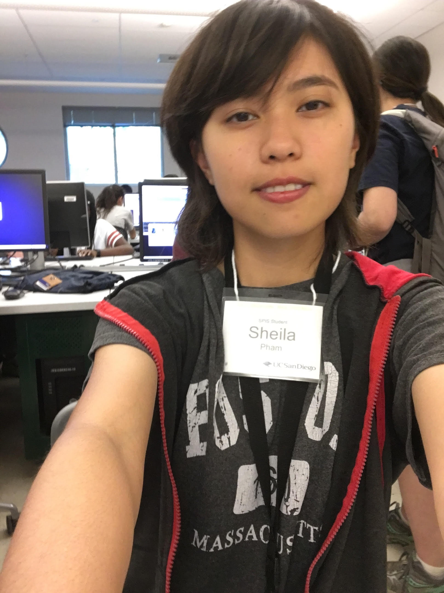

# practice-sheila-p
Hi, I'm Sheila Pham. I'm from LA by the Winnetka area. I came to SPIS hoping to understand what computer science really is and how it applies to every aspect of my life. I want to create something from nothing too. I want to be able to make websites, code, and understand algorithms. 
I like to draw many things. I also played the trumpet for six years, but not recently for the past year because of school and AP's.

